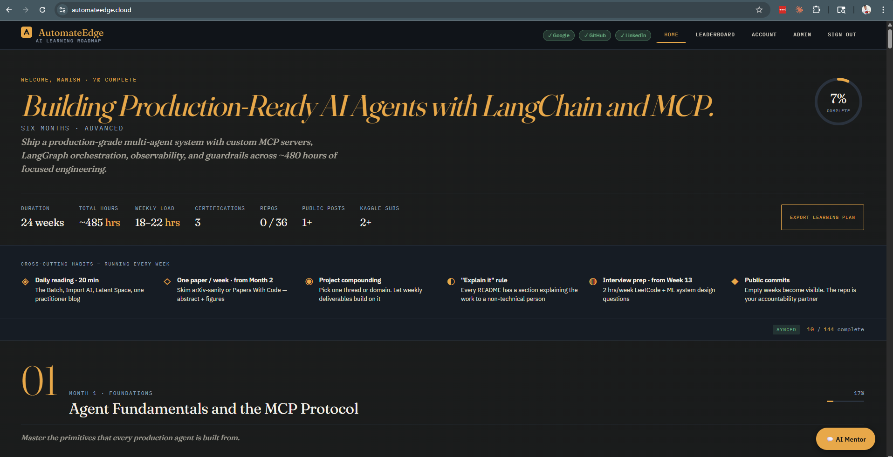
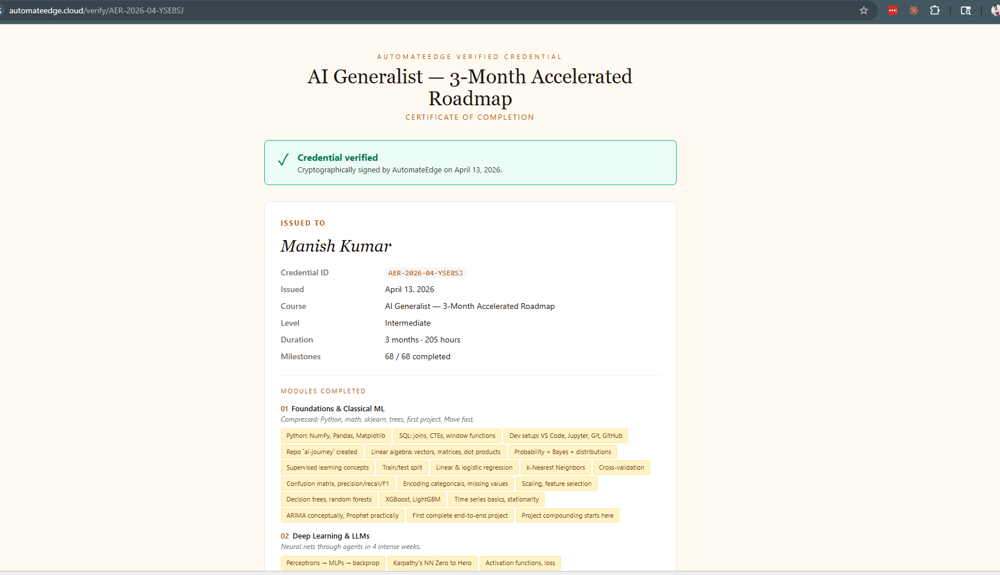
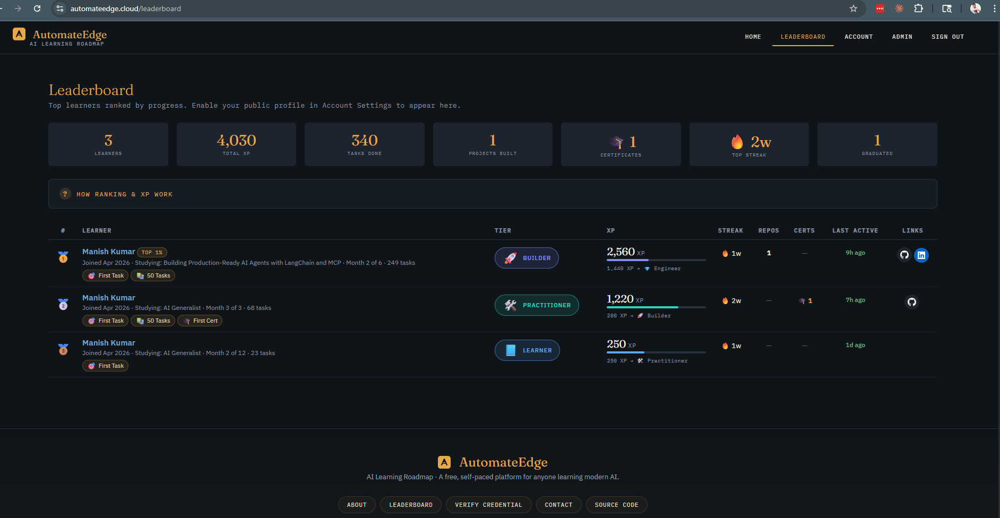

# AutomateEdge — AI Learning Roadmap

**A free, self-paced platform that gives anyone a personalised,
AI-curated 3-to-12-month study plan to learn modern AI from scratch.**
Track your progress, link your GitHub repos as you build, get AI
evaluations of your practice work, and graduate with an HMAC-signed,
publicly-verifiable credential.

Live: **[automateedge.cloud](https://automateedge.cloud)** ·
Blog: **[Building AutomateEdge Solo](https://automateedge.cloud/blog/01)**

## Screenshots

<!-- Drop PNGs into docs/screenshots/ with these filenames -->
| Hero + plan                        | Certificate                                       | Leaderboard                                       |
| ---------------------------------- | ------------------------------------------------- | ------------------------------------------------- |
|  |  |  |

## Why it exists

Static roadmaps drift within a quarter. Paid cohort programs
gate-keep on price and schedule. AutomateEdge sits between them:
AI-generated curricula that refresh every quarter, human-reviewed
before publish, free for every learner.

## What it does

- **Personalised plans.** Pick goal, duration (3, 6, 9, 12 months),
  level. 6 resources per week, split 3 video + 3 non-video.
- **Progress tracking.** Week-by-week + month-by-month + overall
  bars. Collapsible cards, two-column resource grid.
- **Auth.** Google OAuth or email OTP. JWT cookies, httpOnly.
- **GitHub linking + AI evaluation.** Link practice repos per week;
  ask AI to grade the README + top files. Secrets stripped before
  anything leaves the server.
- **Quality-gated AI curriculum pipeline.** Generate → review →
  refine → validate → 15-dimension score. Only human-approved
  templates go live; `last_reviewed_by` + `last_reviewed_on` are
  stamped on every publish.
- **HMAC-signed certificates.** Credential ID carries a truncated
  HMAC over user + course + issue date; `/verify/<id>` re-derives
  and checks. WeasyPrint-rendered PDF with a QR code to the verify
  page and an OpenGraph image for LinkedIn.
- **Gamified leaderboard.** XP formula (tasks + distinct repos +
  streak weeks + cert bonus), 7 tiers Apprentice → AI Guru,
  achievement pills, last-active recency color-coding.
- **AI chat.** Per-week Q&A, calibrated to the learner's stated
  experience and goal.
- **Seven AI providers on a fallback chain.** Gemini Flash 2.5 →
  Groq → Cerebras → Mistral → DeepSeek → Sambanova → Anthropic
  with a circuit breaker + per-provider daily $ cap.

For the full story — choices, trade-offs, what'd I do differently —
read the blog post: **[Building AutomateEdge Solo](https://automateedge.cloud/blog/01)**.

## Tech stack

- **Backend:** Python 3.12 · FastAPI · SQLAlchemy 2.0 (async) · SQLite
- **Auth:** Google OAuth2 · email OTP · JWT cookies
- **Frontend:** Vanilla JS, no framework, progressive enhancement
- **AI:** 7 providers via a single fallback router (`app/ai/provider.py`)
- **PDF:** WeasyPrint 63.1 · pydyf 0.11 · qrcode
- **Deployment:** Docker Compose on a VPS behind Caddy

## Quick start

```bash
# 1. Clone and configure
git clone https://github.com/manishjnv/AIExpert.git
cd AIExpert
cp .env.example .env
# Edit .env — at minimum: JWT_SECRET, GEMINI_API_KEY, SMTP_*

# 2. Bring up the stack
docker compose up -d

# 3. Run migrations
docker compose exec backend alembic upgrade head

# 4. Visit http://localhost:8080
```

Run tests:

```bash
docker compose exec backend pytest -q
```

CI runs the full suite on every push to master and every PR
(see `.github/workflows/ci.yml`).

## Contributing

Issues and PRs welcome. Before opening one:

1. Check `docs/TASKS.md` — if the feature is already scoped there,
   link it. Otherwise open an issue first so we can agree on shape.
2. Read `CLAUDE.md` section 5 — the non-negotiable rules
   (no secrets in code, SQLAlchemy-only, async throughout, etc.)
3. Add a test. The green baseline is 127 passing; CI gates PRs on that.
4. Keep PRs small and reviewable. One feature slice per PR.

## Documentation

| File | Purpose |
|---|---|
| `CLAUDE.md` | Primary context for Claude Code — read first |
| `docs/PRD.md` | Product requirements |
| `docs/ARCHITECTURE.md` | Technical architecture + stack rationale |
| `docs/DATA_MODEL.md` | Database schema |
| `docs/API_SPEC.md` | REST endpoints |
| `docs/TASKS.md` | Phased build plan |
| `docs/SECURITY.md` | Security rules + threat model |
| `docs/AI_INTEGRATION.md` | AI provider setup + prompts |
| `docs/DEPLOYMENT.md` | VPS deployment workflow |
| `docs/HANDOFF.md` | Living session state |
| `docs/blog/` | Blog posts (source markdown) |

## License

MIT — build on it, fork it, share it.

---

**Built solo by [@manishjnv](https://github.com/manishjnv)
with Claude Code.** Feedback: open the footer → Contact on
[automateedge.cloud](https://automateedge.cloud), or file an issue.
